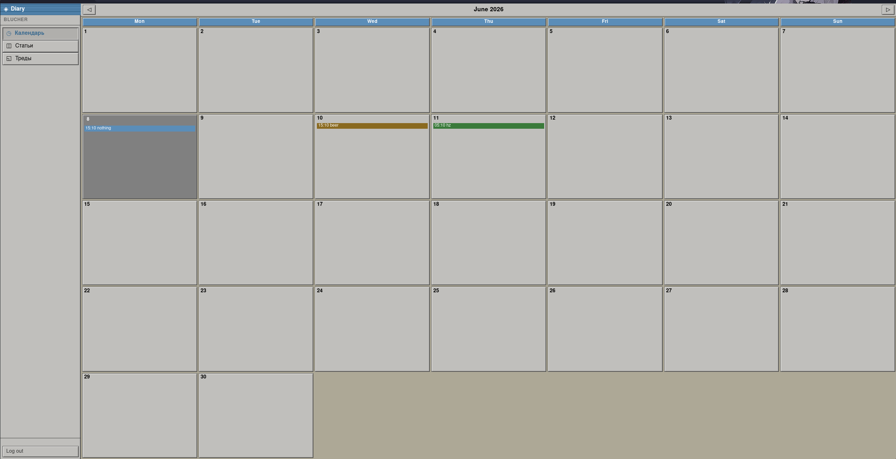
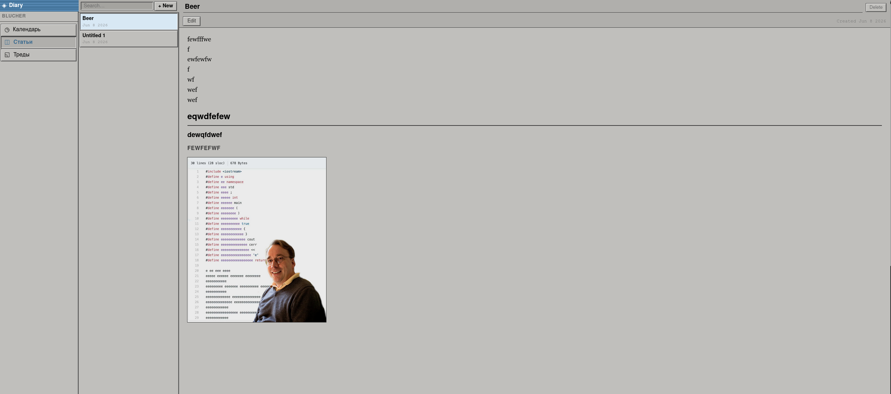
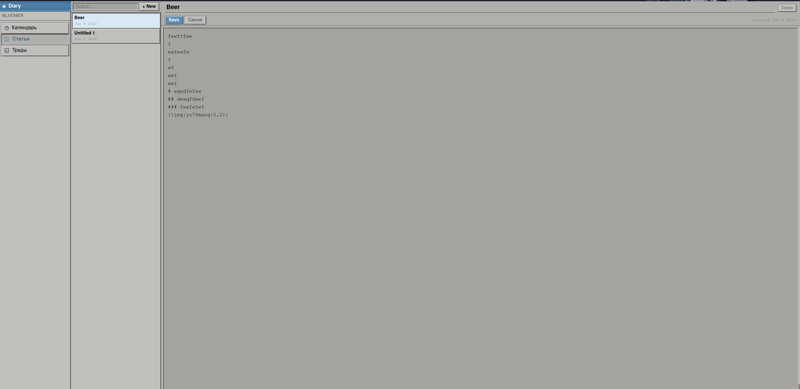
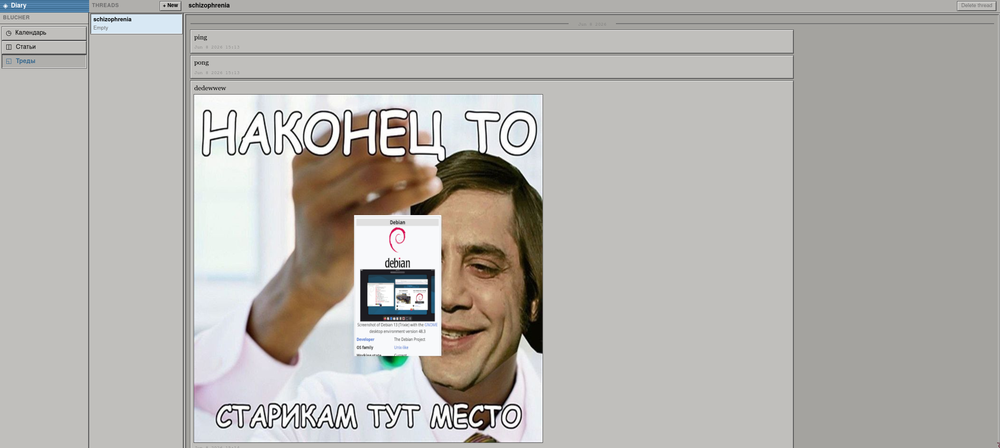
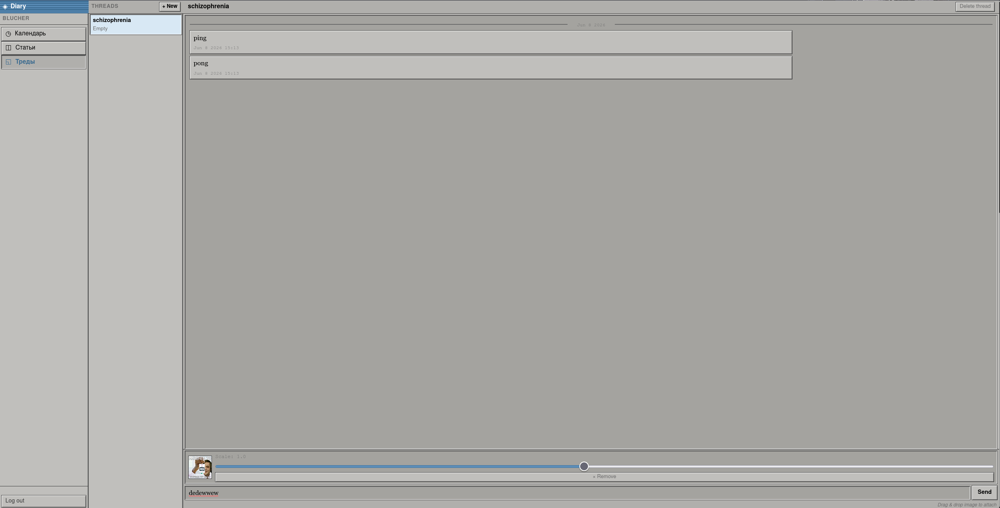

# HL.diary

> 🇷🇺 [Русский](#русский) · 🇬🇧 [English](#english)

---

## Русский

**HL.diary** — личный зашифрованный дневник с веб-интерфейсом для установки на домашний сервер. Сервер хранит только зашифрованный блоб и не видит ни одного байта ваших данных — всё шифрование и дешифрование происходит прямо в браузере.

### Возможности

- **Календарь** — события с цветовой маркировкой, навигация по месяцам
- **Статьи** — вики-подобный редактор с поддержкой Markdown-разметки (`# заголовки`, `**жирный**`, `[[ссылки на другие статьи]]`), встроенными изображениями и поиском
- **Треды** — чат-лента для заметок и черновиков с поддержкой прикреплённых изображений
- **Клиентское шифрование** — AES-256-GCM + PBKDF2 (200 000 итераций); сервер никогда не видит ваш пароль или содержимое

### Скриншоты

**Календарь**


**Статьи — режим просмотра**


**Статьи — режим редактирования**


**Треды**


**Треды — прикрепление изображения**


### Стек

| Часть | Технология |
|---|---|
| Бэкенд | Rust · Rocket 0.5 |
| Фронтенд | TypeScript · SPA (без фреймворков) |
| Шифрование | Web Crypto API · AES-256-GCM · PBKDF2 |
| Контейнер | Docker · Alpine Linux |

### Запуск через Docker

```bash
docker run -d \
  -p 8000:8000 \
  -v diary_data:/app/diaries \
  your_username/hl-diary:latest
```

Или через Docker Compose:

```bash
docker compose up -d
```

Откройте браузер на `http://localhost:8000`, создайте дневник с именем пользователя и паролем — готово.

### Сборка из исходников

Зависимости: **Rust** (stable), **Node.js** 22+, **esbuild**

```bash
# Установить esbuild
npm install -g esbuild

# Собрать фронтенд
bash run.sh

# Запустить сервер
cargo run --release
```

### Формат файла дневника

```
┌─────────────────────────────────────┐
│  байты 0..128  │  write-key (raw)   │  ← проверяется сервером при PUT / DELETE
├────────────────┴────────────────────┤
│  байты 128..   │  зашифрованный     │  ← сервер не смотрит внутрь
│                │  payload клиента   │
└─────────────────────────────────────┘
```

### REST API

| Метод | Путь | Заголовок | Тело |
|---|---|---|---|
| `POST` | `/api/diary/:username` | `X-Diary-Key` | зашифрованные байты |
| `GET` | `/api/diary/:username` | — | — |
| `PUT` | `/api/diary/:username` | `X-Diary-Key` | зашифрованные байты |
| `DELETE` | `/api/diary/:username` | `X-Diary-Key` | — |

---

## English

**HL.diary** is a personal encrypted diary with a web interface for your homelab. The server stores only an encrypted blob and never sees a single byte of your data — all encryption and decryption happens directly in the browser.

### Features

- **Calendar** — color-coded events with month navigation
- **Articles** — wiki-like editor with Markdown support (`# headings`, `**bold**`, `[[links to other articles]]`), embedded images and search
- **Threads** — a chat-style feed for notes and drafts with image attachments
- **Client-side encryption** — AES-256-GCM + PBKDF2 (200 000 iterations); the server never sees your password or content

### Screenshots

**Calendar**


**Articles — preview mode**


**Articles — edit mode**


**Threads**


**Threads — image attachment**


### Stack

| Part | Technology |
|---|---|
| Backend | Rust · Rocket 0.5 |
| Frontend | TypeScript · SPA (no framework) |
| Encryption | Web Crypto API · AES-256-GCM · PBKDF2 |
| Container | Docker · Alpine Linux |

### Running with Docker

```bash
docker run -d \
  -p 8000:8000 \
  -v diary_data:/app/diaries \
  your_username/hl-diary:latest
```

Or with Docker Compose:

```bash
docker compose up -d
```

Open your browser at `http://localhost:8000`, create a diary with a username and password — done.

### Building from source

Requirements: **Rust** (stable), **Node.js** 22+, **esbuild**

```bash
# Install esbuild
npm install -g esbuild

# Build the frontend
bash run.sh

# Run the server
cargo run --release
```

### Diary file format

```
┌─────────────────────────────────────┐
│  bytes 0..128  │  write-key (raw)   │  ← checked server-side on PUT / DELETE
├────────────────┴────────────────────┤
│  bytes 128..   │  client payload    │  ← opaque; never inspected by the server
└─────────────────────────────────────┘
```

### REST API

| Method | Path | Header | Body |
|---|---|---|---|
| `POST` | `/api/diary/:username` | `X-Diary-Key` | encrypted bytes |
| `GET` | `/api/diary/:username` | — | — |
| `PUT` | `/api/diary/:username` | `X-Diary-Key` | encrypted bytes |
| `DELETE` | `/api/diary/:username` | `X-Diary-Key` | — |

### Security notes

- The server performs constant-time key comparison to prevent timing attacks
- Diary writes are atomic (temp file + rename) — a crash mid-write never corrupts data
- Usernames are restricted to `[A-Za-z0-9_-]`, max 64 chars, preventing path traversal
- Request body is limited to 10 MiB
